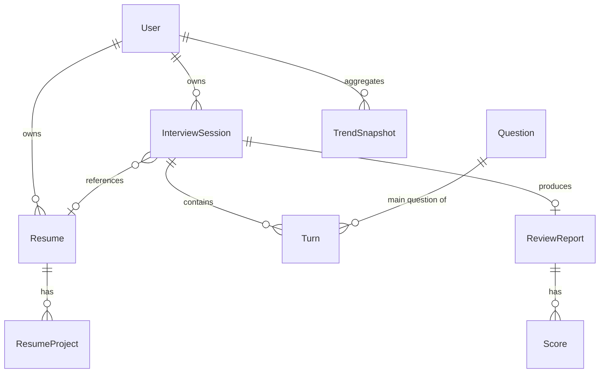

# byteready V1 项目设计文档

> 版本:V1 设计草案
> 日期:2026-05-10
> 状态:已与产品方就核心分叉达成共识,可进入实施

## 1. 概览

### 1.1 项目愿景
**byteready** 是面向**意向进入互联网的技术岗 / 综合技术与产品岗**人员的 AI 面试一站式训练 + 模拟平台。核心场景是个人求职者的"模拟练 → 真实考"前置准备,价值锚点是 V1 的差异化重点 —— **复盘**。

### 1.2 目标用户
- 互联网技术岗候选人(前端 / 后端 / 算法 / 数据 / AI)
- 综合技术与产品岗候选人(技术产品经理 / 解决方案)
- V1 不区分校招 / 社招,但用户在创建面试 session 时自选**职级**(初 / 中 / 高 / 专家)

### 1.3 V1 核心价值主张
对照 `docs/Research-AI-Review.md` 调研里识别的几个市场空白:
1. **复盘是数据流终点**:每场模拟面试都沉淀为结构化、可视化、可对比的报告
2. **简历项目驱动追问**:简历不是装饰,项目条目直接成为面试官的追问起势点
3. **跨场趋势可见**:多次模拟产生的 5 轴评分聚合成进步曲线,而不是一次性工具

### 1.4 V1 边界(明确不做)
| 不做 | 原因 |
|---|---|
| 防作弊(眼神追踪 / 屏幕共享检测 / 第二机位) | 个人练习场景,不是企业评估 |
| 多模态评估(微表情 / 语调情感) | 高复杂度,V1 占位即可 |
| 实时双工流式语音(可打断) | 工程深水,V1 用回合制 push-to-talk |
| 文生图 / Rerank | 已配 .env,但 V1 用例不足 |
| 移动端 PWA / 原生 App | 桌面 Web 优先 |
| 企业版 / 私有部署 | toC 优先 |

## 2. 设计原则

整个 V1 围绕一句话:**"基建扎实、深度优化简单做"**。

### 2.1 必须扎实的(基建层)
| 模块 | 扎实标准 |
|---|---|
| 用户 / 数据隔离 | `owner_id` 单层,所有查询走鉴权中间件 |
| ApiResponse 信封 | 沿用 `@byteready/shared` 的 `ok / err`,不裸 JSON |
| 简历解析 pipeline | 三 stage 边界清晰(parse → extract → store),每 stage 可单测 |
| 语音 WS 协议适配层 | 火山 ASR/TTS 二进制帧封装、错误恢复、重连,独立 lib 可单测 |
| 复盘数据合约 | 评分 + 逐题点评的 JSON schema 严格,前端组件按 schema 渲染 |
| 题库 schema | 岗位 / 职级 / 分类 / 主问题 / 期望要点,后续题目内容可灌入而不动 schema |

### 2.2 占位即可的(深度优化层)
| 模块 | 占位策略 |
|---|---|
| 简历项目识别精度 | LLM 一次性抽取,用户可手动修正 |
| 评分算法客观性 | LLM 直接打 1-5 分,不接 BARS 行为锚定 |
| ASR 嘈杂环境鲁棒性 | 火山默认参数,引导用户在安静环境录音 |
| 题库丰富度 | Chinese_interview_large 抽 50-100 道 seed,够 demo |
| 跨场弱项诊断引擎 | V1 仅折线图,弱项推断留 V2,先在 schema 留接口 |

接口和数据形状立得住,**将来换实现不动调用方**。

## 3. 技术栈与运行时

沿用骨架(参见 `CLAUDE.md`):

```
apps/web        Vite + React 19 + Tailwind v4
apps/server     Hono on Node 24.15.0(零 flag 直跑 TS)
packages/shared TS 源码直出,前后端共享类型 + ApiResponse 信封
pnpm monorepo,packageManager 锁定 pnpm 版本
```

V1 引入的新依赖:

| 依赖 | 用途 | 安装位置 |
|---|---|---|
| `better-auth` | 认证(邮箱密码 + cookie session) | `apps/server` |
| `drizzle-orm` + `drizzle-kit` | ORM + migration | `apps/server` |
| `pg`(默认) | Postgres 驱动;持久层选型敲定后再固定 | `apps/server` |
| `pdf-parse` | PDF → 纯文本 | `apps/server` |
| `mammoth` | DOCX → 纯文本 | `apps/server` |
| `zod` | 入参校验,前后端共用 schema | `packages/shared` |
| `recharts` | 雷达图 + 折线图 | `apps/web` |
| `@radix-ui/*`(按需) | 表单 / Dialog / Toast 等无样式原语 | `apps/web` |

外部 API(已配 `.env`,后端代理调用):

| 用途 | 服务 | V1 使用 |
|---|---|---|
| LLM | Moonshot Kimi(OpenAI 兼容) | ✅ 全程使用 |
| Embedding | SiliconFlow `BAAI/bge-*` | ✅ 仅"项目复述质量"轴 |
| Rerank | SiliconFlow | ⏸ stub 函数留着,V1 不调用 |
| 文生图 | SiliconFlow Z-Image-Turbo | ⏸ stub 函数留着 |
| ASR | 火山 SeedASR(WebSocket 二进制) | ✅ 模拟面试 |
| TTS | 火山豆包 2.0(WebSocket 二进制) | ✅ 模拟面试 |

## 4. 信息架构与用户旅程

### 4.1 路由树
```
/                      → 未登录跳 /login,已登录跳 /dashboard
/login                 → 登录 / 注册
/dashboard             → 主仪表盘:近期面试 + 5 轴趋势 + "开始一场"入口
/resumes               → 简历列表 + 上传 / 粘贴入口
/resumes/:id           → 简历详情 + 项目条目编辑
/interviews/new        → 新建面试 session(选岗位/职级,可选简历)
/interviews/:id/run    → 面试中(语音交互页)
/reviews/:id           → 单场复盘报告(雷达图 + 逐题点评 + 总评)
/trends                → 跨场趋势详情页(更多过滤维度)
/settings              → 账号 / 数据导出 / 删除
```

### 4.2 用户旅程
首次注册用户:
```
注册 → onboarding(选目标岗位+职级 + 上传/粘贴简历)
     → Dashboard(空状态有"开始第一场面试"大按钮)
     → 新建面试 → 面试中 → 复盘报告
     → 第二场面试 → Dashboard 出现 5 轴趋势折线
```

Demo 评委体验(双轨):
- **预填账号**(`demo@byteready` / 固定密码):已有 1-2 份样例简历 + 2-3 场历史面试 + 5 轴趋势曲线,登录即"老用户"视图
- **真实 onboarding**:任意新邮箱注册,完整走一遍流程

## 5. 数据模型

### 5.1 实体关系图


### 5.2 核心实体(只列关键字段)
| 实体 | 关键字段 | 备注 |
|---|---|---|
| `User` | `id` `email` `name` `created_at` | Better Auth 表结构 + 业务扩展字段 |
| `Resume` | `id` `owner_id` `title` `raw_text` `parsed_at` `source_format` | `source_format` ∈ `pdf / docx / paste` |
| `ResumeProject` | `id` `resume_id` `name` `period` `role` `summary` `keywords[]` `order` | **5 字段** schema,简历"项目"部分 |
| `InterviewSession` | `id` `owner_id` `position` `level` `target_company?` `resume_id?` `status` `started_at` `ended_at` | `status` ∈ `pending / running / ended` |
| `Question` | `id` `position` `level` `category` `main_text` `expected_points[]` | seed 自 Chinese_interview_large;`category` ∈ `bagua / project / algorithm`(沿用小林 coding 三大主类) |
| `Turn` | `id` `session_id` `index` `kind` `question_id?` `text` `audio_meta?` `created_at` | `kind` ∈ `interviewer_main / interviewer_followup / candidate / system`;V1 不存音频文件,只存 ASR 后的 text |
| `ReviewReport` | `id` `session_id` `overall_text` `generated_at` `llm_meta`(JSON) | 一份完整复盘报告 |
| `Score` | `id` `report_id` `axis` `value`(0-5 浮点) `evidence`(string) | `axis` ∈ 5 轴枚举(见 §7.4.2) |
| `TrendSnapshot` | `id` `owner_id` `axis` `value` `session_id` `created_at` | 用于趋势页折线;每场结束往里写一行 / 轴 |

### 5.3 用户隔离
- 所有实体的"持有人"字段统一叫 `owner_id`,关联 `User.id`
- Hono 中间件读 cookie session → 注入 `c.set('userId', ...)` → 所有查询拼 `where owner_id = ?`
- V1 无 workspace / team 概念,纯单租户

## 6. API 设计

### 6.1 通用规范
- 所有响应走 `ApiResponse<T>`(`@byteready/shared`)
- `ok(data)` / `err(code, message)` 辅助函数,不要手写裸对象
- 全局 `notFound` 与 `onError` 已经在 `apps/server/src/index.ts`,新路由不重复处理
- 入参校验用 `zod`,失败返回 `err('VALIDATION', msg)`

### 6.2 路由清单
```
POST   /api/auth/*                  Better Auth 自带(注册/登录/登出/session)
GET    /api/me                      当前用户信息

GET    /api/resumes                 当前用户简历列表
POST   /api/resumes                 上传(multipart) 或 粘贴(json: {raw_text})
GET    /api/resumes/:id             单份简历 + 项目条目
PATCH  /api/resumes/:id/projects/:pid  手动修正某个项目条目
DELETE /api/resumes/:id

GET    /api/questions               按 position+level+category 过滤,分页
                                    (内部用,题库管理后续可加 admin 路由)

POST   /api/interviews              新建 session(参数:position, level, resume_id?, target_company?)
GET    /api/interviews              列表(用户自己的)
GET    /api/interviews/:id          详情(含 turns)
POST   /api/interviews/:id/end      结束面试(触发复盘)

WS     /api/voice/asr               浏览器 → 后端 → 火山 ASR(后端做协议适配)
WS     /api/voice/tts               文本 → 后端 → 火山 TTS → 音频流

POST   /api/reviews                 (内部触发,end 接口调用)生成复盘报告
GET    /api/reviews/:id             复盘报告详情(scores + per-turn commentary + overall)

GET    /api/trends                  跨场趋势(参数:axis?, since?, position?)
```

### 6.3 鉴权
- `/api/auth/*` 公开
- 其他全部经 `requireAuth` 中间件
- 中间件失败统一 `err('UNAUTHORIZED', ...)`,前端拦截跳 `/login`

## 7. 模块详细设计

### 7.1 认证模块
- **方案**:Better Auth + 邮箱密码 + cookie session
- **Drizzle adapter**:Better Auth 官方支持,直接接 Drizzle 数据库
- **session cookie**:HttpOnly + Secure(生产) + SameSite=Lax
- **后续扩展**:加 GitHub / Google OAuth 不换框架,V1 不上

### 7.2 简历解析 pipeline

三 stage,每 stage 边界清晰、可单测:

```
[输入] PDF/DOCX/纯文本
    ↓
Stage 1: 文档 → 纯文本
    - PDF: pdf-parse
    - DOCX: mammoth
    - 粘贴: 直接接收
    - 失败 → err('PARSE_FAILED', '简历文件未能识别为文字,请尝试粘贴纯文本版本')
    ↓
Stage 2: 纯文本 → 结构化 JSON
    - LLM(Kimi)+ 严格 zod schema 返回:
      basic { name, email, phone }
      educations [...]
      experiences [...]
      projects [{ name, period, role, summary, keywords[] }]   ← 5 字段
    ↓
Stage 3: 落库
    - Resume 主表 + ResumeProject 子表(批量 insert)
    - raw_text 也存,便于后续重新抽取或人工核对
```

**用户修正路径**:`/resumes/:id` 页可对每个 `ResumeProject` 直接编辑(行内表单),保存走 `PATCH /api/resumes/:id/projects/:pid`。"项目是重点"在这里落地 —— 不是只读结果。

### 7.3 模拟面试模块

#### 7.3.1 Session 创建
- 必填:`position`、`level`
- 可选:`resume_id`(选了 → 个性化追问)、`target_company`(影响出题风格 prompt 提示)
- 创建后状态 `pending`,跳 `/interviews/:id/run` 进入面试中

#### 7.3.2 回合状态机(单回合)
```
idle ─(用户按下"录音")→ recording
                          │
recording ─(松开/静音)→ asr_in_progress
                          │
asr_in_progress ─(text 收到)→ llm_thinking
                                │
llm_thinking ─(LLM 文本)→ tts_streaming
                            │
tts_streaming ─(播放完)→ idle (等待用户下一回合)
                            │
                     或 ─(LLM 决定切下一题)→ next_question(自动播报新主问题 → tts → idle)
```

#### 7.3.3 火山 WS 适配层
独立 lib,放 `apps/server/src/lib/voice/`:
- `volcAsrClient.ts`:封装 ASR 二进制帧(参考 `.local/PROJECT_PREP.md` 的 Event 表),输入 PCM/Opus 流,输出文本
- `volcTtsClient.ts`:封装 TTS 二进制帧,输入文本,输出音频流
- `protocol.ts`:帧格式常量、错误码、重连策略
- 单测覆盖:帧打包 / 解包 / 错误码处理(用本地 echo 服务器 mock)

**注意**:火山新版控制台只用 `X-Api-Key`,不要照网上旧版 `X-Api-App-Key` 文档。

#### 7.3.4 面试官 LLM Prompt(Kimi)
System prompt 模板(摘要):
```
你是一名资深 {position} 面试官,正在面试一位 {level} 候选人。
{if resume}候选人简历项目摘要:{resume_projects_summary}{/if}
当前主问题:{main_question_text}
追问准则:
- 每道主问题在 3-5 轮内决定是否切换(soft)
- 候选人答得深 → 进一步技术追问;答得浅 → 引导补充
- 不要照本宣科,做"压力测试"型追问
- 用中文,中英技术术语保持英文原词
返回 JSON: { reply: string, decision: "follow_up" | "next_question" | "end" }
```

#### 7.3.5 题目流转 + 软性兜底
- session 开始时,从 `Question` 表按 `position+level` 抽 6-8 道主问题(混合 bagua / project / algorithm,有简历则把 1-2 道 project 类替换为"基于简历项目 X"的现生问题)
- 每道主问题进入面试时,后端跟踪"已追问轮数"
- LLM 返回 `decision: "next_question"` 或 已追问 ≥ 5 轮,切下一题
- 整场 45 分钟硬上限,后端定时器到点强制 `end`
- 用户随时可手动"切下一题" / "结束面试"

#### 7.3.6 Transcript 持久化
每回合完成 → 写两行 `Turn`(候选人 + 面试官)到 DB,带 `index` 排序、`question_id` 关联当前主问题、`audio_meta` 记录时长(不存音频文件)。

### 7.4 复盘模块(V1 重点)

#### 7.4.1 触发
- 显式:用户点"结束面试"按钮 → `POST /api/interviews/:id/end`
- 隐式:45 分钟硬上限到点
- 隐式:LLM 返回 `decision: "end"`

服务端事务:`InterviewSession.status = 'ended'` → 异步触发 `POST /api/reviews`(内部调用)→ 完成后用户通知。

#### 7.4.2 5 个评分轴
| 轴 | 含义 | 数据依据 |
|---|---|---|
| 专业知识深度 | 技术概念准确度、边界条件、原理理解 | LLM 读 transcript |
| 项目复述质量 | 简历项目条目 vs 面试中讲述的匹配度与深度 | LLM + Embedding 余弦相似度辅助 |
| 表达与结构(STAR) | 回答是否结构化(情境-任务-行动-结果) | LLM 读 transcript |
| 逻辑与问题解决 | 思维路径清晰度、应变 | LLM 读 transcript |
| 沟通自然度 | 语速 / 卡顿 / 填充词 / 中英混用流畅 | LLM 读 transcript(V1 不接声学特征) |

每轴 `value` 0-5 浮点,`evidence` 一句话引用 transcript 片段作为证据(参考调研报告里"溯源性"要求)。

#### 7.4.3 复盘 LLM 调用
**单次大调用**(性价比 + 一致性最优):
```
输入:
  - 简历项目摘要(resume.projects[*].name + summary + keywords)
  - 主问题列表 + expected_points
  - 完整 transcript(turns 按 index 拼接)
  - "项目复述质量"辅助分:每个简历项目的概述 embedding × 面试中提到该项目的 transcript 段 embedding,余弦相似度数组,作为提示信息塞进 prompt

输出严格 JSON:
{
  scores: [
    { axis: "专业知识深度", value: 3.8, evidence: "..." },
    ...
  ],
  per_question: [
    { question_id, your_summary: "...", key_gaps: ["..."], improvements: ["..."] },
    ...
  ],
  overall_text: "总评 200 字"
}
```

后端用 zod 校验返回,违规则重试一次,再失败则降级保存原文(标记 `llm_meta.fallback = true`)。

#### 7.4.4 跨场趋势
- 每场复盘完成 → 5 行 `TrendSnapshot` 入库(每轴一行)
- `/trends` 页:按时间排序的折线图(5 条线,每轴一条),最近 N 场平均
- 弱项诊断:V1 仅"最近 3 场最低分轴是 X"的简单规则,LLM 一句话总结(占位即可)

### 7.5 前端组件框架

| 组件 | 技术 |
|---|---|
| 雷达图 | `recharts` `<RadarChart>` |
| 折线图 | `recharts` `<LineChart>` |
| 表单 / Dialog | `@radix-ui/*` + Tailwind |
| 录音按钮 | 自实现:状态圈(idle / recording / processing / playing)+ 音量波形(Canvas + Web Audio API) |
| Toast | `sonner` 或 `radix-ui/toast` |
| 路由 | `react-router-dom` v7 |

**面试中页布局**:
```
┌────────────────────────────────────────────────┐
│ 主问题(大字) + 进度(第 3/8 题,已追问 2 轮)  │
├──────────────────────────┬─────────────────────┤
│ Transcript 流(滚动)     │ 录音按钮 + 状态     │
│ - 你: ...                │ [⬤ Push to talk]    │
│ - 面试官: ...            │ ───────             │
│ - 你: ...                │ [切下一题][结束]    │
└──────────────────────────┴─────────────────────┘
```

## 8. LLM Prompt 框架

集中放 `apps/server/src/lib/prompts/`,按用途分文件:
- `resumeExtract.ts`:简历抽取 prompt + zod 输出 schema
- `interviewer.ts`:面试官 system prompt 模板 + decision JSON schema
- `reviewScore.ts`:复盘评分 prompt + 输出 JSON schema

每个 prompt 单测:固定输入 → 模拟 LLM 返回 → zod 校验通过。

## 9. 安全与合规

| 维度 | 措施 |
|---|---|
| API Key | 全部 `.env`,后端代理,前端不可见 |
| Cookie session | HttpOnly + Secure + SameSite=Lax(Better Auth 默认) |
| 密码存储 | Better Auth 用 bcrypt/scrypt(默认) |
| 简历内容 | 视为敏感数据,`raw_text` 与 projects 仅持有人可读 |
| 录音 | **不持久化原始音频**,只存 ASR 后 transcript 文本 |
| 用户删除 | `/settings` 页"删除我的所有数据"(级联 user / resumes / interviews / reviews / trends) |
| CORS | 同源部署,无需 CORS;开发环境用 Vite proxy |
| 速率限制 | V1 占位:加一个简单 in-memory 限流中间件(每用户每分钟 60 请求)|

## 10. 部署与本地开发

### 10.1 部署形态
- **国内服务器**(火山 ASR/TTS WS 是国内域名,海外部署跨境延迟与可达性都成问题)
- 前后端**同域**:nginx / caddy 反代
  - `/` → `apps/web` 静态产物(`pnpm --filter @byteready/web build` 后的 `dist/`)
  - `/api/*` → Hono 后端进程
- DB:Postgres(本地 docker compose,生产托管 Supabase / Neon / 自建)

### 10.2 本地开发
沿用 `CLAUDE.md` 命令:
```bash
nvm use && corepack enable && pnpm install
pnpm dev          # 前后端同时
pnpm typecheck    # 全 workspace
pnpm test         # vitest
pnpm verify       # typecheck + test + build,交付门
```

### 10.3 环境变量(在现有 `apps/server/src/env.ts` 基础上补)
```
SERVER_PORT=8787

# 持久层(选型敲定后填)
DATABASE_URL=postgresql://...

# Auth
BETTER_AUTH_SECRET=xxxxxxxx
BETTER_AUTH_URL=http://localhost:8787

# LLM
KIMI_API_KEY=...
KIMI_BASE_URL=...
KIMI_MODEL=...

# Embedding
SILICONFLOW_API_KEY=...
SILICONFLOW_EMBEDDING_MODEL=BAAI/bge-...

# 火山
VOLCENGINE_API_KEY=...
VOLCENGINE_ASR_*=...
VOLCENGINE_TTS_*=...
```

`.env.example` 同步更新占位符,**不得贴真实值**。

## 11. 测试策略

按 `CLAUDE.md` 的"功能交付标准":每个新功能模块**必须**配套测试。V1 的 vitest 测试组织:

| 测试类型 | 覆盖 |
|---|---|
| 单元测试 | shared 类型构造、prompt 模板渲染、火山帧打包/解包、zod schema |
| 集成测试 | Hono 路由(用 `route.request()` 模拟请求,不起 HTTP)、DB Drizzle 查询(本地 PG / sqlite mem)|
| LLM 调用 | mock LLM 客户端,断言 prompt 与 schema |
| E2E | V1 不强制(前端无组件测试基建);demo 前手动 smoke test |

每次交付前 `pnpm verify` 必须全绿。

## 12. V2+ 路线展望(留接口不实现)

| V2+ 方向 | V1 留的接口 |
|---|---|
| 弱项诊断引擎 | `TrendSnapshot` 表 + `/api/trends` 已经吐数据,V2 只需加一个分析服务读它 |
| 防作弊 | 前端 WebRTC + ServiceWorker 检测点已留,V1 不开 |
| 多模态评估 | `Turn.audio_meta` 字段保留,V2 可加声学特征字段 |
| 题库扩充 / 自动入库 | `Question` 表已有 schema,V2 加 admin 路由批量导入 |
| 企业版 | `User` 加 `org_id` 即可,V1 默认 null |
| Rerank / 文生图 | `.env` 已配,stub 函数已留 |

## 13. 实施任务拆解(供基建实施参考)

按依赖顺序,每阶段交付即跑 `pnpm verify`:

| Phase | 内容 | 依赖 |
|---|---|---|
| 0. 基建 | Better Auth 接入 + Drizzle schema + migration + ApiResponse 中间件 + zod 共享 schema | - |
| 1. 简历 | 上传/粘贴 + 三 stage pipeline + ResumeProject 编辑 UI | 0 |
| 2. 题库 | Chinese_interview_large seed 脚本 + Question 路由 | 0 |
| 3. 语音底座 | 火山 ASR/TTS 适配 lib + WS 路由 + 单测 | 0 |
| 4. 面试 | Session 创建 + 面试中页 + 状态机 + Turn 持久化 + 软性兜底 | 1, 2, 3 |
| 5. 复盘 | 评分 LLM + Embedding 辅助 + Score/ReviewReport + 雷达图组件 | 4 |
| 6. 趋势 | TrendSnapshot 入库 + /trends 折线图 + Dashboard 集成 | 5 |
| 7. 打磨 | demo 账号脚本 + onboarding 流程 + Toast / 错误处理 | 6 |

## 14. 决策共识汇总(grill 出的结论)

V1 实施过程中如有疑义,以本表为准:

| # | 决策点 | 共识 |
|---|---|---|
| 1 | 时间盒 | 基建扎实、深度优化简单做(无硬截止) |
| 2 | 目标岗位 | 用户自选岗位+职级,题库/Prompt 按选择切 |
| 3 | 复盘形态 | 结构化报告 + 5 轴雷达 + 跨场趋势 |
| 4 | 持久层 | 默认 Postgres + Drizzle,留可替换接口 |
| 5 | 认证 | Better Auth + 邮箱密码 |
| 6 | 语音模式 | 回合制 push-to-talk |
| 7 | 简历项目 schema | 5 字段:项目名 / 时间 / 职责 / 概述 / 关键词 |
| 8 | 面试 Session 创建 | 岗位+职级必填,简历可选 |
| 9 | 复盘维度 | 5 轴 + 跨场趋势 |
| 10 | 题库冷启动 | Chinese_interview_large 抽 50-100 题 seed,主问题来自题库,追问 LLM 动态生成 |
| 11 | 追问深度 | LLM 完全动态决定,软性兜底:每题 3-5 轮 prompt 引导 + 45 分钟硬上限 + 用户手动控制 |
| 12 | 录音存储 | 仅存 transcript 文本 |
| 13 | 简历格式 | PDF + DOCX + 文字粘贴(读取异常告知用户) |
| 14 | AI 能力栈 | LLM(Kimi) + Embedding(BAAI/bge);Rerank/文生图 V1 不上,留 stub |
| 15 | Demo 种子 | 双轨:预填 demo 账号 + 真实 onboarding 引导 |
| A | 部署 | 国内服务器,前后端同域 |
| B | 用户隔离 | owner_id 单层,无 workspace |
| C | 单场默认 | 6-8 道主问题,30-45 分钟,可手动结束 |
| D | 复盘 LLM 调用 | 一次大调用,严格 JSON schema |
| E | 文档落点 | 本文件 `docs/V1-Design.md` |
